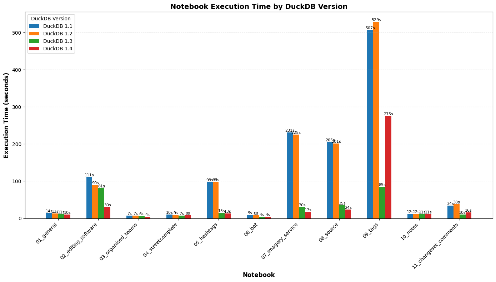

# Using DuckDB for OpenStreetMap Statistics

About 3 years ago I was searching for up to date information about which Editors are used for adding data to OpenStreetMap. After I couldn't find any I [created my own scripts](https://github.com/piebro/openstreetmap-statistics) for generating tables and data from the OSM Changeset Dataset.

## Using Pandas and Dask

The original data is saved in one compressed .xml file, so the first step is to extract and save it as table. I started with using csv and then switched to parquet and partitioning by month. After more preprocessing I get a dataset with the size of ~2.5GB.

I got a lot of out of memory errors trying to analyze the data using pandas, so I switched to Dask to use a similar python api without needing to load all data in memory. This worked well, but many queries were quite slow and I started caching many intermediate results that were used by different queries and after looking at the code more than a year later I realized the whole codebase was a pretty big mess.

## Switching to DuckDB

A few months ago I was thinking about using a different approach. I am using some SQL at my new day job and kept hearing about DuckDB performance and ease of use. I did a test to check if DuckDB can handle querying the data on my laptop and in the smallest GitHub Action Runner in a reasonable amount of time and it did!

This allows me to make a big and painfully long refactor of the codebase and treat every table and plot as one SQL Query instead of caching intermediate results. I also removed many abstractions, so that every query is atomic and a lot easier to understand. All in all, I'm pretty happy with the setup right now.

## Benchmarking DuckDB Versions

After reading about some performance gains of DuckDB 1.4 (I am using DuckDB 1.3.2 right now), I was curious how this would affect me. I ran a simple benchmark running all Notebooks using the different DuckDB versions (using e.g. `uv run --with "duckdb==1.1.*"` makes this straightforward) and here are the results:

Queries are mostly getting faster with newer version with the exception of the 09_tags Notebook. It's the only Notebook that uses `unnest(["array","of","strings","..."])` a lot, so this might explain why it's an outlier. In general the biggest performance gain was between version 1.2 and 1.3 and I'm not sure if I would have started using DuckDB for this project if it was still as slow as the 1.2 version.